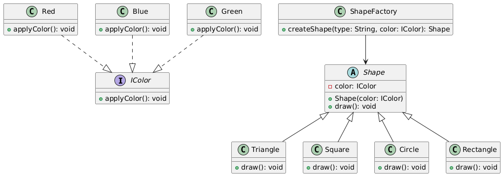

# BridgePatternApp

The idea of this application is to implement the **Bridge Design Pattern** in the creation of geometric shapes with different colors. Additionally, we use the **Factory Design Pattern** to handle the creation of the shapes.

## Bridge Design Pattern

The **Bridge** pattern is used to separate the abstraction of an object from its implementation, allowing them to vary independently. In this case:

- The abstraction is the **Shape** (geometric shapes like `Triangle`, `Square`, `Circle`, and `Rectangle`).
- The implementation is the **Color** (colors like `Red`, `Blue`, and `Green`).

By using the Bridge pattern, we can change the **Shape** without affecting the **Color** and vice versa. Each shape can have different colors, and the color can be applied to any shape.

### Classes

- **Shape** (abstract class): Defines the interface for shapes that can be drawn.
- **Triangle**, **Square**, **Circle**, **Rectangle**: Concrete shapes that inherit from `Shape` and implement the `draw()` method.
- **IColor** (interface): Defines the method `applyColor()` which concrete color classes must implement.
- **Red**, **Blue**, **Green**: Concrete color classes implementing the `IColor` interface.
- **ShapeFactory**: Implements the **Factory Design Pattern** to create shapes with a specified color.

The **ShapeFactory** is responsible for creating the shapes and assigning them a color.

## Factory Design Pattern

The **Factory Design Pattern** is used to create objects without specifying the exact class of the object that will be created. In our case, we use a factory method `createShape()` in the `ShapeFactory` class to create shapes based on the specified type (e.g., `Triangle`, `Square`) and assign them a color (e.g., `Red`, `Blue`).

## Implementation

The application is implemented in **C#** as a console application. The shapes (abstractions) are created with a specified color (implementations), and the **Factory** pattern is used to instantiate the shapes. This ensures that new shapes can be created easily with different color combinations.

## UML Class Diagram

Here is the class diagram representing the relationship between the classes:

## Conclusion

By combining the **Bridge** and **Factory** design patterns, this implementation allows for a flexible and maintainable solution for creating shapes with different colors. The **Bridge** pattern enables the independent variation of shapes and colors, while the **Factory** pattern simplifies the creation of these objects.
